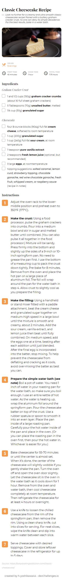

<!-- Please update value in the {}  -->

<h1 align="center">Recipe page</h1>

<div align="center">
   Solution for a challenge from Devchallenges.io.
</div>

<div align="center">
  <h3>
    <a href="https://h-yoshikawa44.github.io/ch-recipe-page/">
      Demo
    </a>
  </h3>
</div>

*The site is now closed, but this assignment was originally posted at `https://legacy.devchallenges.io/solutions/SUwASJDgXBoBuZqxRxk7`.  
（My assignment submission page at the time: `https://legacy.devchallenges.io/challenges/OEKdUZ6xs0h99C38XVht`.）

<!-- TABLE OF CONTENTS -->

## Table of Contents

- [Table of Contents](#table-of-contents)
- [Overview](#overview)
  - [Desktop](#desktop)
  - [Mobile](#mobile)
  - [Built With](#built-with)
- [Features](#features)
- [How To Use](#how-to-use)
- [learned/improved](#learnedimproved)
- [Acknowledgements](#acknowledgements)
- [Contact](#contact)

<!-- OVERVIEW -->

## Overview
### Desktop


### Mobile


### Built With

<!-- This section should list any major frameworks that you built your project using. Here are a few examples.-->

Base
- [HTML](https://developer.mozilla.org/ja/docs/Web/HTML)
- [CSS](https://developer.mozilla.org/ja/docs/Web/CSS)
- [Node.js](https://nodejs.org/): 22.13.1
- [Vite](https://ja.vitejs.dev/)

Other major libraries
- [postcss-preset-env](https://github.com/csstools/postcss-plugins/tree/main/plugin-packs/postcss-preset-env)

## Features

<!-- List the features of your application or follow the template. Don't share the figma file here :) -->

This application/site was created as a submission to a DevChallenges challenge. The challenge was to build an application to complete the following user stories:

- [x] User story: I can see a recipe with ingredients and instructions
- [x] User story: I can select a checkbox if I have the ingredients
- [x] User story: I can see the number of servings, baking times

## How To Use

To clone and run this application, you'll need [Git](https://git-scm.com/) and [Node.js](https://nodejs.org/en/download/) (which comes with [npm](https://www.npmjs.com/)) installed on your computer. From your command line:

```bash
# Clone this repository
git clone https://github.com/h-yoshikawa44/ch-recipe-page.git
or
git clone git@github.com:h-yoshikawa44/ch-recipe-page.git

# Install dependencies
npm install

# Run the Vite
npm run dev
```

## learned/improved
- How to layout with grid-row and grid-column
- How to create a custom list number element using a pseudo-element.

## Acknowledgements

<!-- This section should list any articles or add-ons/plugins that helps you to complete the project. This is optional but it will help you in the future. For exmpale -->

- [コピペで使えるリストデザイン34選：CSSで箇条書きをおしゃれに](https://saruwakakun.com/html-css/reference/ul-ol-li-design)
- [CSS Grid Layout を極める！（基礎編）](https://qiita.com/kura07/items/e633b35e33e43240d363)

## Contact

- Website: [h-yoshikawa44.com](https://h-yoshikawa44.com)
- GitHub: [@h-yoshikawa44](https://github.com/h-yoshikawa44)
- X: [@yoshi44_lion](https://x.com/yoshi44_lion)
